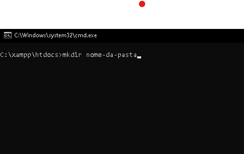

# Como instalar e configurar o Laravel 

Oi, pessoal! Aqui quem fala é o Bruno, segue o tutorial para instalar e configurar um ambiente de desenvolvimento do Laravel.

## O que você irá precisar:
- <a href="https://www.apachefriends.org/pt_br/index.html">XAMPP</a>
- <a href="https://getcomposer.org/download/">Composer</a>
## Dentro do seu CMD entre em C:\xampp\htdocs crie uma pasta com o comando mkdir:  

## Entre na pasta com o comando cd: 

## Instale o Laravel com o seguinte comando: 
`composer create-project laravel/laravel tech-share`

## Mude para o diretório do projeto criado:
`cd tech-share`

## Inicie o o servidor local de desenvolvimento do Laravel:
`php artisan serve`

## Copie e cole no seu navegador:
`http://127.0.0.1:8000`

## License
